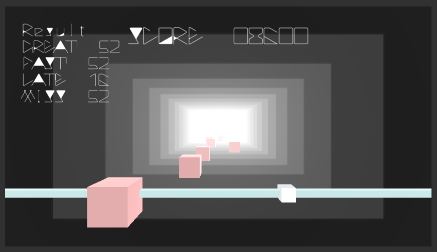

### slidebeats

---
### ゲーム概要
- プラットフォーム WebGL
- 画面解像度 850x480、できればフルスクリーン1920x1080
- ゲーム概要 マウスのアクション要素がある音ゲー
- 操作方法 ノートが来たらマウスを重ねて、スペースキーを押す
- ルール ７曲あり、すべてクリアでエンディング（のつもり）
 - 体力制か、スコアランク制か検討中
- アセット
 - フォント [Waptia-Light](https://moji-waku.com/waptia/)
